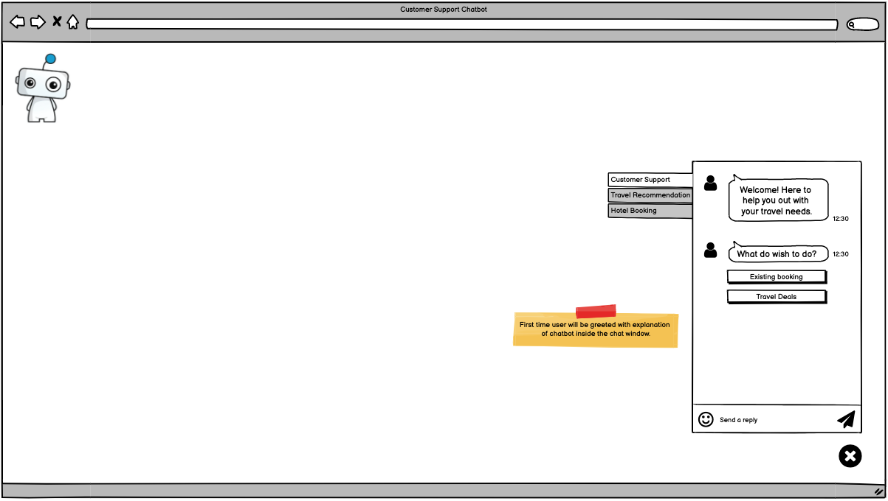
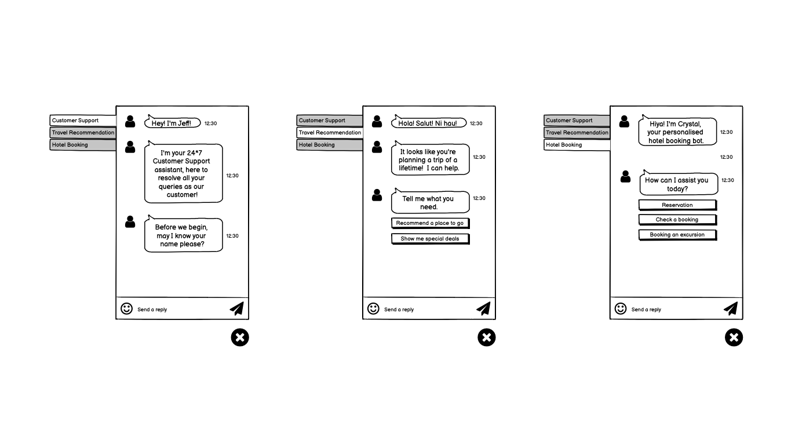
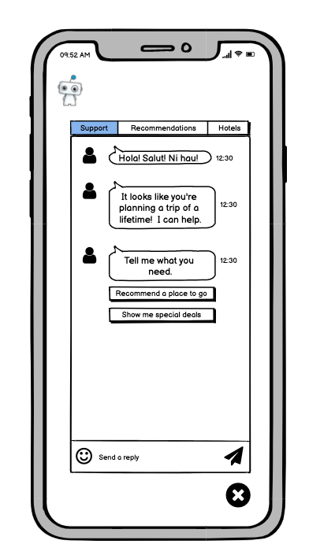

#### Use of AI in the Travel Industry

This emerging technology has been around in the travel space for a number of years now with many recognised brands, such as Qantas, SkyScanner, Expedia, having successfully deployed it across their operations.

#### My Role

For us Experience Designers a large part of the job is to design products and digital services that are great for the end user but we also need to design for the business too.  In this project I assumed my usual role as, UX Designer but I also played the part of Product Owner too.

#### What were the problems or opportunities that the organisation were facing?
Streamlining operations to improve the booking experience for customers.  With machine learning there was a great opportunity for creating dynamic content and increased customer service efficiency.

#### Solution
AI was to play a big part in helping to alleviate user pain points. We understood the power of automation and the goal of completing a digital transformation program to include chatbot implementation and dynamically driven content applications driven by AI was to be instrumental in doing so.  Just as SkyScanner had done before us we were looking at a chatbot solution to become our smart travel assistance. 

#### Why
As a publicly listed, Travel-Distribution Company providing a diverse range of travel wholesale products and services to markets globally, we could see that such a solution had the potential to help the organisation achieve it's strategic priorities.  In doing so it would improve customer engagement and the booking experience.  The benefits could help to build and maintain better relationships, increase efficiencies, reduce costs, engage customers and improve conversions.  We needed buy-in from the stakeholders.

#### Core Ethical Considerations
Ethical concerns are big priority in software development especially when artificial intelligence is involved.  We built a short list of considerations that we felt were important to us as a team and aligned them with the organisation's objectives.

* Transparency - there should be complete transparency to ensure people are fully aware of when they are being impacted by AI.
Human centred and wellbeing - I believe that AI systems should always respect human rights and diversity and any systems should be the benefit of individuals, society and the environment.
* Fairness - AI systems should be unbiased and not discriminate.
* Privacy and security - AI systems should respect people’s privacy and their data and should
practice a high level of security.
* Accountable - those involved at different stages of AI system development should be responsible and accountable for their choices and the outcomes.
* Contestability - in the event that an AI system has had a significant impact on someone, a group, society or the environment they should be permitted to freely challenge the use of the system.

#### Key Performance Indicators
We have chosen to measure the following key performance indicators as they align neatly with the organisation’s strategic priorities.

Activity volume | Evaluating the number of interactions from the time the user asks a simple question. 
Conversation length | Average length of interactions between chatbot and users.
Comprehension level | This would be continuously evolving. It is a measure of the chatbot’s comprehension and knowledge base.
Non-response rates | A measure of the number of times the chatbot fails to respond to a question. Can also be measured against comprehension level metric above.
Retention rate | This is the proportion of users who have consulted the chatbot on repeated occasions.
User engagement | measuring the number of messages exchanged.

#### Designing for chatbots 
From our discovery we understood the risks, assumptions, the personas, user and system requirements.  I began creating wireframes to illustrate the main conversation flows and to anticipate any usability issues that might arise early on.  The wireframes were also great for getting stakeholders involved in the design process.

To trigger conversation from my working group I first created a wireframes for a desktop view, the conversation types that are currently required and a layout suitable for smaller devices.

We were now able to define the three main conversation flows below that meet the requirements of the organisation.  

1. Customer Support
2. Travel Recommendations 
3. Hotel Bookings

For smart phones we had to consider our key priorities to display.

#### Progress Report
We presented our findings to stakeholders and received positive feedback.  Supported by data insights and our well researched rationale we were given a preliminary 'green light' to continue.  Unfortunately the project had to be put on hold due to the pandemic.  I created a high level road map and the next steps are to continue in the design phase and to build a prototype.  User research has continued.  We have completed a deep dive analysis on products that exist on the market already to illiminate the need to reinvent the wheel.
