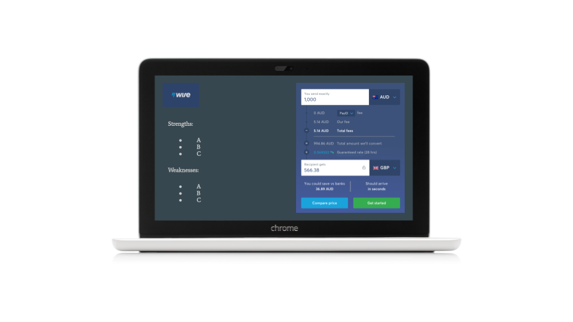
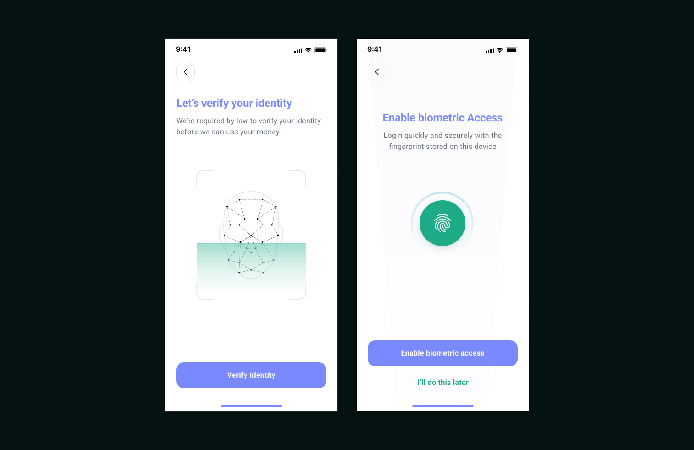
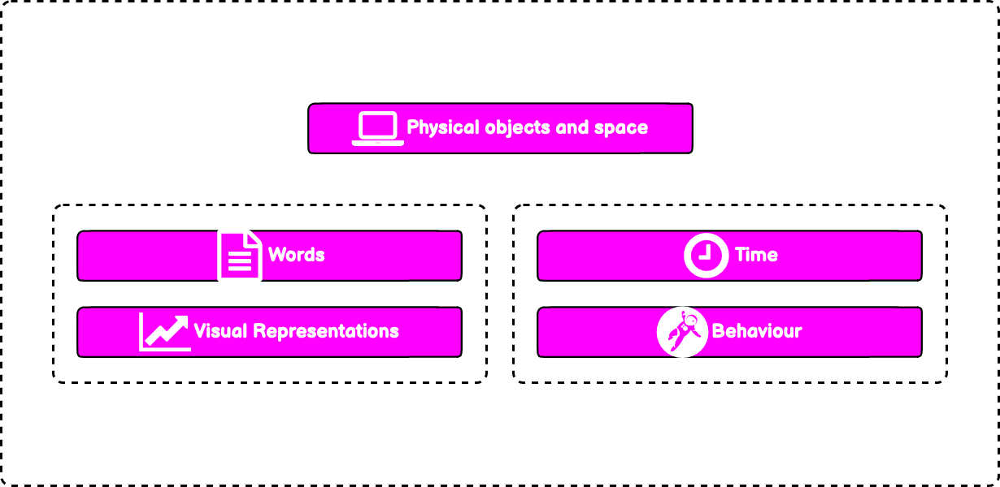
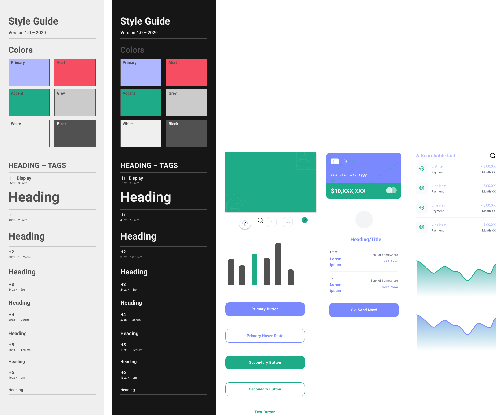

_For confidentiality reasons some content may have been omitted or altered.  In some instances, the designs have been reinterpreted_

### Reinvigorate the movement of funds

Originally launched as a web based SaaS product.  It was a knee-jerk reaction to an urgent business need but unfortunately it was never designed.

The company’s goal being to provide a hassle-free business account solution specifically for overseas, education providers managing their cash-flows.

**The purpose being to:**

* Pay someone, get paid &
* Transfer currencies.

### My Role
**Aligning design with strategy**

In a consulting capacity with 3 months at my disposal I was embedded to provide a tactical approach for improving overall experience of the platform and implement a way to scale and maintain assets.

**At the end of my tenure I delivered:**

* A documented set of discovery insights
* UI Kit with a set of mobile specific components (Still in evolution)
* Concepts for a mobile app solution
* The foundations of a design system

> Build retention and grow the user base

### No clear direction

At the outset of the project there wasn’t a clear vision or specific goals for the experience. Without pre-existing insights, I partnered with our product owner to understand who the users were and how they were currently using the platform to move money around.

### Collect some data and hit some stats

**What do we know already? What do we need to know?**

After interviewing my key stakeholder (Also CEO) and Tech Lead I was now suitably armed with assumptions.

**Leveraging data to drive innovation**

The plan at this stage was to take the hypothesis and develop it into testable solutions.

* Usability testing would help us to identify core stages of the money transfer flow where users might struggle.
* Web analytics and heatmaps to show for example, how many users abandon the process.

### Ask the audience
**User Needs**

> "I can’t find what I’m looking for"

> "It’d be good to see the current exchange rate"

> "What can I pay with?"

Through some quick mapping activities and interviews with users we gleaned the following insights:

**Missing payment options**

The payer did not understand how and what payment options were available to them.

**Long-winded forms**

Not only were forms on the long side but micro-copy and form layout were all elements ripe for improvement..

**Useful information**

We discovered that people would like a level of personalisation in their interface. Simple data showing transfer history, pending transfers were all deemed useful. People also desired live data in the form of currency tools such as current foreign exchange rates.

### Judging the user interface
**What does the current experience look like?**

**Heuristic evaluation** · Following Jakob Nielsen's 10 general principles for interaction design.

**Key problem areas:**

**Visibility of system status**

* Users were confused. They were not being informed and uncertainty was on the rise which usually implies that user confidence is low.

**Irrelevant information**

* E.g. No purpose to this static map below.

**Flexibility & efficiency of use**

* Keyboard shortcuts and touch gestures
* Opportunity for personalisation
* Allow for customisation

### What others are doing?
**Competitive UX Analysis**

**Purpose:** To identify key usability strengths and weaknesses.

**Analysis Objectives**

Review the features and functionality we observed throughout the various competitors’ platforms and then provided several recommendations.  For each one we reviewed their usability strengths and weaknesses.

**We did we want to learn:**

1. How efficient it is to use.
2. Are interactions predictable and intuitive.
3. Could communication of system status be improved.

#### Security Versus Usability
Designing for a regulated sector can spring up surprises.  Something I had underestimated.  As I discovered with the sign up experience.  With Anti-Money Laundering (AML) regulations present you learn that you need to ask the user for a lot of data.  Not just the amount of data you need to ask the user for but the thinking behind the authentication and identity is a huge consideration.

#### Ideas in their infancy
A large part of process was dedicated to sketching and wireframing.  The purpose being to validate ideas in-situ.



> “How might we represent data that is easily consumable and informative?”

Representing data was a large part of the project.  The ability to display information in relation to transactional activities that were occurring in the user’s account.  On a mobile device screen real estate is clearly a limitation.  Test and prioritise!



#### The Interaction Framework
Without having to reinvent the wheel I applied the five dimensions of interaction design tailored to my designs.  The principles aligned perfectly with this type of project. 

**_Defined by a professor at London’s Royal College of Art, Gillian Crampton Smith, and a senior interaction designer, Kevin Silver_**

###### Words (1D) 
encompass text, such as button labels, which help give users the right amount of information.
###### Visual representations (2D) 
are graphical elements such as images, typography and icons that aid in user interaction.
###### Physical objects/space (3D) 
How might users interact with the product or service; for instance, a laptop via a mouse, or a mobile phone via fingers.
###### Time (4D) 
relates to media that changes with time, such as animations, videos and sounds.
###### Behaviour (5D) 
is concerned with how the previous four dimensions define the interactions a product afford - for example, how users might perform actions on a website, or how someone can operate a forklift. Behavior can also refer to how the product responds to user inputs and communicates feedback.

#### Assisted Velocity
To reduce time, effort and cost and in the absence of a UI Designer it was decided that a UI Kit would be the best option to assist in producing the final concepts.  The result is a polished and distinctive interface with subtle interactions and a refined palette.  There is clear delineation between sections without distracting users and delivers a cohesive yet accessible experience.

#### Ecosystem in its infancy
As part of the deliverables pack, it was agreed that the foundations of an experience guideline would be established.  As well as introducing the base style assets, I started the development of a library of some the key UI components.  I partnered with our FED to build a version of this in CODE.  We installed an instance of Storybook.js which is an open source tool for building UI components in isolation.  There by streamlining the dev process, testing and documenting. 

#### More focus on the priorities
In summary, this was an exciting project to collaborate on and there was lots learnt.  On reflection I would have insisted on heavier prioritisation on user needs versus feature desirability.  To raise confidence levels in our discovery I should have tested on a larger participant pool.  Unfortunately getting access to the numbers was difficult.